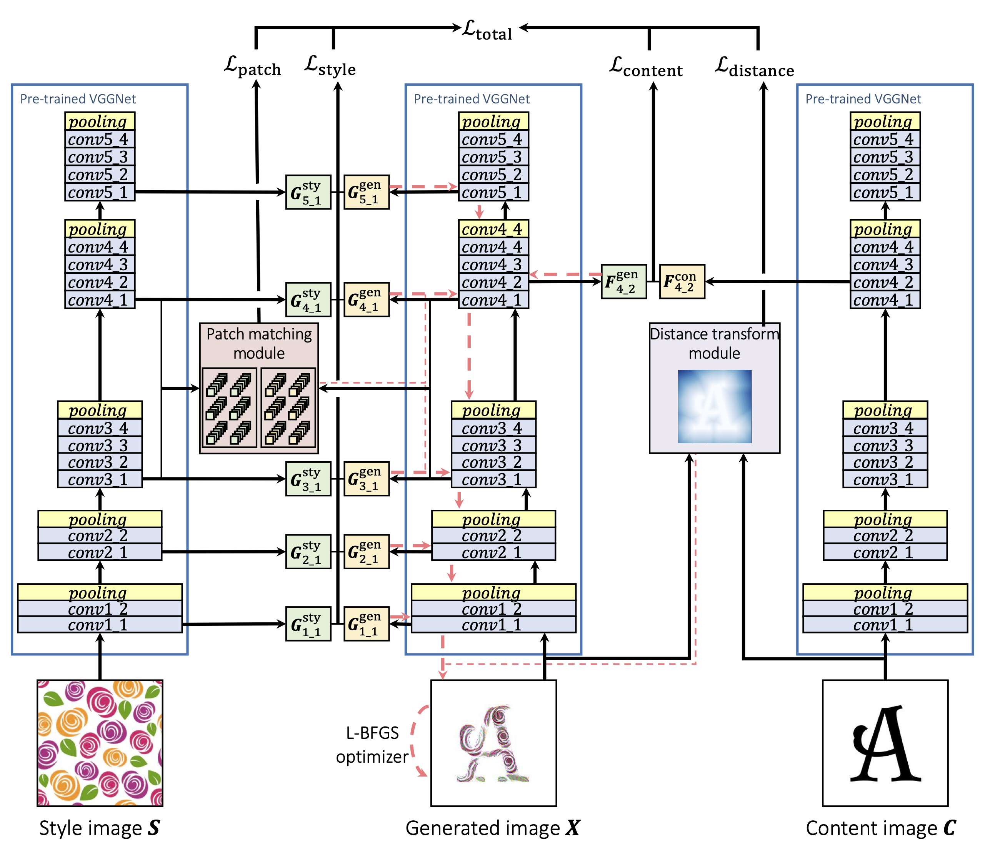

# Guided Neural Style Transfer for Shape Stylization

This is the repository for the implementation of "Guided Neural Style Transfer for Shape Stylization" by G. Atarsaikhan, B. K. Iwana and S. Uchida.

## Table of Contents

1. [Introduction](#introduction)
2. [Results](#results)
3. [Requirements](#requirements)
4. [Running the code](#running-the-code)

## Introduction

We propose a combination of the Gram matrix-based style transfer and Patch matching-based style transfer for shape stylization. This is achieved by adding "Distance transform module" and "Shape matching module" to the regular neural style transfer.

<!--  -->


## Results

<!--  -->


## Requirements

* Python == 3.6.6

* Pytorch == 1.2.0

* Numpy == 1.15.3

* Scipy == 1.1.0

* OpenCV >= 3.x (cv2)

* PIL = 5.3.0

* Matplotlib == 3.0.0

* tqdm == 4.28.1

* Download the pre-trained weights for VGG network from [here](https://drive.google.com/file/d/15cod-tqSo2CUrutAaC3HWAyITJw9R1Gf/view?usp=sharing), and place it on the main folder. (153MB)

## Running the code

### Style transfer
```
python main.py -content_path <path_to_content_image> -style_path <patch_to_style_image>
```
### Other default parser arguments:
```
alpha = 1e-1        # More emphasize on content loss. Override with -alpha
beta  = 1e-1        # More emphasize on style loss. Override with -beta
gamma = 1e-6        # More emphasize on patch matching loss. Override with -gamma
delta = 1e2         # More powerful constrain. Override with -delta
epoch = 5000        # Set the number of epochs to run. Override with -epoch
image size = 256    # Determine image size. Override with -image_size
patch size = 5      # Size of the patch for patch matching module. Override with -patch_size
```
